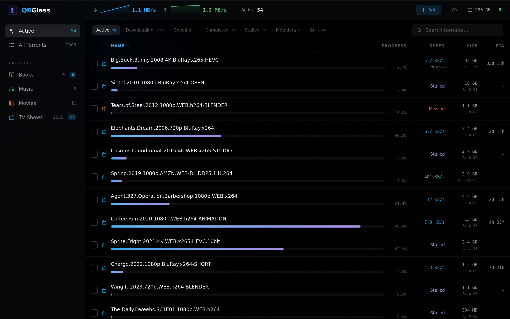
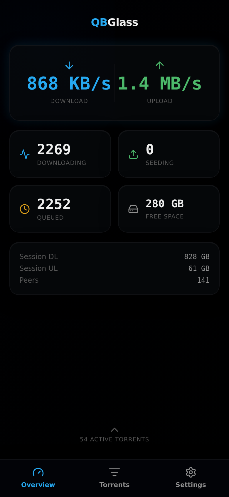
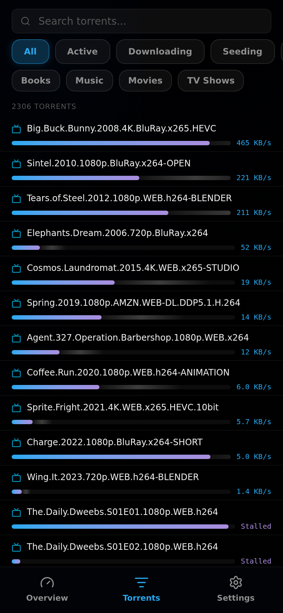

# QBGlass

A glassmorphism dark theme for qBittorrent's Web UI. Responsive desktop and mobile layouts with *arr stack awareness.



<p float="left">
  
  
  
</p>

## Quickstart

1. Download `qbglass-v*.zip` from the [latest release](../../releases/latest)
2. Extract it somewhere permanent (e.g. `C:\QBGlass` or `/opt/qbglass`)
3. In qBittorrent: **Tools > Preferences > Web UI**
4. Check **Use alternative Web UI**
5. Set the folder to where you extracted (the folder containing `public/`)
6. Save and refresh your browser

## Features

- Glassmorphism dark UI with frosted glass panels and accent glows
- Smart default: shows active torrents first, not your full queue
- *arr-aware categories: sonarr, radarr, lidarr, LazyLibrarian shown with media-type icons
- Sortable columns with torrent counts per filter
- Multi-select with bulk pause/resume/delete on desktop
- Add torrents via magnet link or .torrent file upload
- Live speed sparkline graphs
- Mobile: overview dashboard with scroll-to-reveal active list
- Mobile: torrent list with filter chips and tap-to-detail bottom sheet
- PWA installable
- ~77KB gzipped

## Build from source

Requires Node.js 18+.

```sh
git clone https://github.com/smidgedy/qbglass.git
cd qbglass
npm install --legacy-peer-deps
npm run build
```

Output goes to `dist/`. Point qBittorrent's alternative WebUI to a folder with `dist/` contents inside a `public/` subfolder:

```sh
mkdir -p /path/to/qbglass/public
cp -r dist/* /path/to/qbglass/public/
```

Then set qBittorrent's alternative WebUI path to `/path/to/qbglass`.

## Dev

```sh
npm run dev
```

Runs on `http://localhost:5173` with API proxied to `http://localhost:8080` (qBittorrent).

## Tech

React, TypeScript, Vite, Tailwind CSS v4, Zustand, @tanstack/react-virtual, lucide-react.
